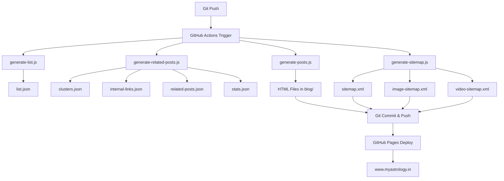

<div align="center">

# 🌟 **MyAstrology**
### *বৈদিক জ্যোতিষ ও হস্তরেখা – ড. প্রদ্যুৎ আচার্য*


<br/>

[](https://github.com/MyAstrology/services/actions/workflows/generate-blog.yml)
[](https://www.myastrology.in)
[](https://www.myastrology.in)
[](https://github.com/MyAstrology/services)
[](https://www.myastrology.in/blog-list.html)
[](https://youtube.com/@myastrology)

> 🔮 **MyAstrology** – ভারতীয় বৈদিক জ্যোতিষ, হস্তরেখাবিদ্যা ও আধ্যাত্মিক পরামর্শের একটি বিশ্বস্ত প্ল্যাটফর্ম।  
> **ড. প্রদ্যুৎ আচার্য**-র নেতৃত্বে আমরা ব্যক্তিগত পরামর্শের মাধ্যমে জীবনের জটিল প্রশ্নের উত্তর দিই।

### 🌐 [www.myastrology.in](https://www.myastrology.in)

</div>

---

## 📋 **সূচিপত্র**

| ক্রম | বিষয় |
|:---:|:---|
| 1 | [🔮 সেবাসমূহ](#-services-offered) |
| 2 | [👨‍🎓 ড. প্রদ্যুৎ আচার্য সম্পর্কে](#-about-dr-prodyut-acharya) |
| 3 | [📞 যোগাযোগ](#-contact) |
| 4 | [👉 পরামর্শ বুক করুন](#-book-your-consultation) |
| 5 | [📁 প্রোজেক্ট স্ট্রাকচার](#-project-structure) |
| 6 | [📝 ব্লগ পোস্টসমূহ](#-blog-posts) |
| 7 | [🔄 অটোমেশন সিস্টেম](#-automation-system) |
| 8 | [🗺️ সাইটম্যাপ](#️-sitemaps) |
| 9 | [⚙️ অটো-জেনারেটেড ফাইল](#️-auto-generated-files) |
| 10 | [🤖 robots.txt](#-robotstxt) |
| 11 | [📌 SEO কীওয়ার্ড](#-seo-keywords) |

---

## 🔮 **Services Offered**

<div align="center">

| আইকন | সেবা | বিবরণ | মূল্য |
|:---:|:---|:---|:---:|
| ✋ | **হস্তরেখা বিচার** | দুই হাতের ছবি পাঠান, ৩-৪ ঘণ্টায় বিশ্লেষণ | ₹১,০০১ |
| 📜 | **জন্মকুণ্ডলী বিশ্লেষণ** | ৩০-৩৫ পাতার PDF রিপোর্ট + ফোন কল | ₹১,৫০১ |
| 🔭👋 | **হস্তরেখা + কুণ্ডলী** | সম্মিলিত বিশ্লেষণ (সেরা ডিল) | ₹২,০০১ |
| 💍 | **যোটোক বিচার** | কুণ্ডলী মিলন, মাঙ্গলিক দোষ বিশ্লেষণ | ₹২,০০১ |
| ❤️ | **প্রেম ও বিবাহ পরামর্শ** | সম্পর্কের জটিলতা ও সমাধান | ₹১,০০১ |
| 💼 | **ক্যারিয়ার ও ব্যবসা** | পেশাগত পথনির্দেশনা | ₹১,০০১ |
| 💎 | **রত্নপাথর পরামর্শ** | গ্রহ অনুযায়ী রত্ন নির্বাচন | ₹১,০০১ |
| 📞 | **অনলাইন পরামর্শ** | ফোন / WhatsApp ভিডিও কল | ₹১,০০১ |
| 🕐 | **শুভ মুহূর্ত নির্বাচন** | বিবাহ, গৃহপ্রবেশ, ব্যবসার শুভ সময় | ₹৫০১ |
| 🏠 | **বাস্তু শাস্ত্র** | বাড়ি-অফিসের বাস্তু সমাধান | প্রয়োজন অনুযায়ী |
| 👶 | **নামকরণ** | নবজাতকের শুভ নাম নির্বাচন | ₹৫০১ |
| ✏️ | **নাম সংশোধন** | নাম শুদ্ধি ও পরিবর্তন | ₹১,০০১ |

</div>

---

## 👨‍🎓 **About Dr. Prodyut Acharya**

<div align="center">

</div>

**ড. প্রদ্যুৎ আচার্য** পশ্চিমবঙ্গের রানাঘাটের একজন প্রখ্যাত জ্যোতিষী ও হস্তরেখাবিদ। বৈদিক জ্যোতিষে **ডক্টরেট (PhD)**, এমফিল ও এমএ-তে **স্বর্ণপদক** প্রাপ্ত। ১৫+ বছরের অভিজ্ঞতায় তিনি ১০,০০০-এরও বেশি মানুষকে ক্যারিয়ার, বিবাহ, স্বাস্থ্য ও আধ্যাত্মিক কল্যাণে পথনির্দেশ দিয়েছেন।

| বিষয় | তথ্য |
|:---|:---|
| 📍 অবস্থান | রানাঘাট, নদিয়া, পশ্চিমবঙ্গ |
| 🎓 শিক্ষাগত যোগ্যতা | PhD, MPhil, MA (সবকটিতেই স্বর্ণপদক) |
| 🏆 পুরস্কার | Maa Sarada Devi Award, Swami Vivekananda Award, Best of the Best 2018 |
| 🎬 YouTube | ২,২৪,১৫০+ সাবস্ক্রাইবার |
| ⭐ রিভিউ | ২৭৬+ পাঁচতারা রিভিউ (Google, JustDial, Facebook) |

---

## 📞 **Contact**

<div align="center">

| মাধ্যম | যোগাযোগ |
|:---:|:---|
| 📱 Call | [+91 93331 22768](tel:+919333122768) |
| 💬 WhatsApp | [wa.me/919333122768](https://wa.me/919333122768) |
| ✉️ Email | [info@myastrology.in](mailto:info@myastrology.in) |
| 🌐 Website | [www.myastrology.in](https://www.myastrology.in) |
| 📘 Facebook | [@Dr.ProdyutAcharya](https://www.facebook.com/Dr.ProdyutAcharya) |
| 🎬 YouTube | [@myastrology](https://youtube.com/@myastrology) |
| 📸 Instagram | [@myastrology.in](https://www.instagram.com/myastrology.in) |

</div>

---

## 👉 **Book Your Consultation**

<div align="center">

জীবনের গুরুত্বপূর্ণ প্রশ্নের সঠিক উত্তর পান।  
অনলাইনে বা সরাসরি পরামর্শ নিন **ড. প্রদ্যুৎ আচার্য**-র কাছ থেকে।

### 🔐 [এখনই বুক করুন – Razorpay](https://pages.razorpay.com/Myastrology)

</div>

---

## 📁 **Project Structure**

```

MyAstrology/services/
│
├── 📂 .github/workflows/
│   ├── 🔄 generate-blog.yml          # Main CI/CD pipeline
│   ├── 🔄 fetch-reviews.yml          # Google Reviews auto-fetch
│   └── 🔄 generate-rashifal.yml      # Daily rashifal generator
│
├── 📂 assets/
│   ├── 📂 css/                       # Stylesheets
│   │   ├── 📄 numerology.css         # Numerology styles (NEW)
│   │   └── 📄 social-share.css       # Social share styles (NEW)
│   ├── 📂 fonts/                     # Font files
│   │   ├── 🔤 Montserrat.woff2       # Montserrat font
│   │   └── 🔤 fa-brands-400.woff2    # FontAwesome brands
│   └── 📂 images/                    # Image assets
│
├── 📂 blog/                          # Generated HTML files from .md
├── 📂 gallery/                       # Gallery images
├── 📂 images/                        # Site images (featured, og, twitter)
│
├── 📂 learning/                      # Learning Hub
│   └── 📄 index.html                 # Learning page (NEW)
│
├── 📂 rashifal/                      # 🪐 Daily Rashifal (NEW)
│   ├── 📄 2026-03-23.html
│   ├── 📄 2026-03-24.html
│   ├── 📄 2026-03-25.html
│   ├── 📄 2026-03-26.html
│   ├── 📄 2026-03-27.html
│   ├── 📄 2026-03-28.html
│   ├── 📄 2026-03-29.html
│   ├── 📄 2026-03-30.html
│   ├── 📄 2026-03-31.html
│   ├── 📄 2026-04-01.html
│   ├── 📄 index.html
│   └── 📄 rss.xml
│
├── 📂 js/                            # JavaScript modules (NEW)
│   ├── 📂 core/                      # Core utilities
│   │   ├── 📄 compatibility-core.js  # Compatibility engine
│   │   ├── 📄 number-utils.js        # Numerology utilities
│   │   └── 📄 planet-relations.js    # Planetary relations
│   ├── 📂 renderers/                 # UI renderers
│   │   └── 📄 compatibility-renderer.js  # Compatibility renderer
│   ├── 📄 intent-detector.js         # User intent detection
│   ├── 📄 main.js                    # Main JS entry
│   └── 📄 numerology-data.js         # Numerology data
│
├── 📂 src/
│   ├── 📂 content/
│   │   ├── 📂 blog/                  # 📝 ALL BLOG POSTS (Markdown)
│   │   │   ├── 📄 list.json
│   │   │   ├── ⚙️ generate-list.js
│   │   │   ├── ⚙️ generate-sitemap.js
│   │   │   ├── ⚙️ generate-image-sitemap.js
│   │   │   ├── ⚙️ generate-video-sitemap.js
│   │   │   ├── ⚙️ generate-news-sitemap.js
│   │   │   └── 📝 100+ .md files     # Blog posts (বাংলা)
│   │   │
│   │   └── 📂 rashifal/              # 🪐 Rashifal system
│   │       ├── ⚙️ generate-rashifal.js
│   │       ├── 🧩 template.html
│   │       └── 📊 rashifal-data.json
│   │
│   └── 📂 data/                      # 📊 Auto-generated data
│       ├── 📄 clusters.json          # Topic clusters
│       ├── 📄 internal-links.json    # Internal links mapping
│       ├── 📄 related-posts.json     # Related posts slugs
│       ├── 📄 stats.json             # Generation statistics
│       └── 📄 tags.json              # Tag configuration
│
├── 📂 scripts/                       # ⚙️ Utility scripts
│   ├── ⚙️ auto-generate.js
│   ├── ⚙️ generate-posts.js
│   ├── ⚙️ generate-related-posts.js
│   ├── ⚙️ update_reviews.js
│   ├── ⚙️ watch.js
│   └── ⚙️ tag-config.js
│
├── 📄 index.html                     # Homepage
├── 📄 about.html                     # About Dr. Prodyut Acharya
├── 📄 astrology.html                 # Astrology services
├── 📄 palmistry.html                 # Palmistry services
├── 📄 gemstone.html                  # Gemstone recommendations
├── 📄 vastu-science.html             # Vastu services
├── 📄 vedic-astronomy.html           # Vedic astronomy
├── 📄 rashifal.html                  # Daily rashifal page
├── 📄 panjika.html                   # Panjika page
├── 📄 numerology.html                # Numerology page
├── 📄 blog.html                      # Blog landing
├── 📄 blog-list.html                 # Blog listing
├── 📄 gallery.html                   # Gallery
├── 📄 video.html                     # Video gallery
├── 📄 reviews.html                   # Google Reviews
├── 📄 contact.html                   # Contact
├── 📄 privacy-policy.html
├── 📄 terms-of-use.html
├── 📄 best-astrologer-in-kolkata.html
├── 📄 best-astrologer-in-nadia.html
├── 📄 best-astrologer-in-west-bengal.html
│
├── 📄 robots.txt
├── 🗺️ sitemap-index.xml
├── 🗺️ sitemap.xml
├── 🗺️ image-sitemap.xml
├── 🗺️ video-sitemap.xml
├── 🗺️ sitemap-news.xml
│
├── 📄 reviews.json                   # Google Reviews data
├── 📄 CNAME                          # Custom domain
├── 📄 .nojekyll
├── 📄 .gitignore
├── 📦 package.json
├── 🔒 package-lock.json
├── 📄 README.md
└── 📄 1774208636226.png              # Root image asset
```


## 📝 **Blog Posts**

> **১০০+ বাংলা ব্লগ পোস্ট** নিয়মিত প্রকাশিত হচ্ছে। প্রতিটি পোস্ট **AI-লাইক অ্যানালাইসিস** এর মাধ্যমে ক্লাস্টার ও সম্পর্কিত পোস্ট চিহ্নিত করা হয়।


<details>
<summary>📖 সম্পূর্ণ ব্লগ তালিকা দেখুন (ক্লিক করুন)</summary>

# স্লাগ বিষয়
1 advanced-palmistry-neuroscience-connection অ্যাডভান্সড পামিস্ট্রি ও নিউরোসায়েন্স সংযোগ
2 agrahayan-mase-janma-12-rashi-swabhab-karma অগ্রহায়ণ মাসে জন্ম - ১২ রাশির স্বভাব ও কর্ম
3 ai-uncertainty-astrology-palmistry-guidance AI, অনিশ্চয়তা ও জ্যোতিষ-হস্তরেখার গাইডেন্স
4 ai-yuge-ortho-bhalobasha-bhagya-pradyut-acharya AI যুগে অর্থ, ভালোবাসা ও ভাগ্য
5 artha-anartha-maraka-bhaba-analysis অর্থ-অনর্থ মারক ভাব বিশ্লেষণ
6 artha-ki-sukh-dey-jyotish-darshan-parashar অর্থ কি সুখ দেয়? জ্যোতিষ দর্শন
7 ashar-mase-janma-12-rashi-swabhab-karma আশার মাসে জন্ম - ১২ রাশির স্বভাব ও কর্ম
8 ashwin-mase-janma-12-rashi-swabhab-karma আশ্বিন মাসে জন্ম - ১২ রাশির স্বভাব ও কর্ম
9 baisakh-mase-janma-12-rashi-swabhab-karma বৈশাখ মাসে জন্ম - ১২ রাশির স্বভাব ও কর্ম
10 bangla-maser-namakarana-nakshatra-purnima-rahasya বাংলা মাসের নামকরণ, নক্ষত্র ও পূর্ণিমার রহস্য
11 bhadra-mase-janma-12-rashi-swabhab-karma ভাদ্র মাসে জন্ম - ১২ রাশির স্বভাব ও কর্ম
12 bhagya-karma-astrology-palmistry ভাগ্য ও কর্ম - জ্যোতিষ ও হস্তরেখায়
13 bhagya-kharap-naki-ami-nije-shotru-chayer-dokan ভাগ্য খারাপ নাকি আমি নিজেই শত্রু?
14 bhagya-ki-sabar-bhalo-hoy-sampurna-bisleshan ভাগ্য কি সবার ভালো হয়? সম্পূর্ণ বিশ্লেষণ
15 bhala-manush-haaar-sati-path ভালো মানুষ হওয়ার সত্য পথ
16 bibaha-rekha-ki-bole-biye-prem-dampattya বিবাহ রেখা কী বলে? বিবাহ, প্রেম ও দাম্পত্য
17 bishas-ki-kusanskar-prakriti-manush-joytish বিশ্বাস কি কুসংস্কার? প্রকৃতি, মানুষ ও জ্যোতিষ
18 brischik-lagna-jataker-swabhab-karma-bibaha-bhagya বৃশ্চিক লগ্নজাতকের স্বভাব, কর্ম, বিবাহ ও ভাগ্য
19 brisha-lagna-jataker-swabhab-karma-bibaha-bhagya বৃষ লগ্নজাতকের স্বভাব, কর্ম, বিবাহ ও ভাগ্য
20 chaitro-mase-janma-12-rashi-swabhab-karma চৈত্র মাসে জন্ম - ১২ রাশির স্বভাব ও কর্ম
21 chinta-shakti-bigyan-joytish-darshan চিন্তা শক্তি, বিজ্ঞান ও জ্যোতিষ দর্শন
22 damodarer-bali-jibon-dorshon দামোদরের বলি - জীবন দর্শন
23 dhanu-lagna-jataker-swabhab-karma-bibaha-bhagya ধনু লগ্নজাতকের স্বভাব, কর্ম, বিবাহ ও ভাগ্য
24 dharma-ki-prokrit-artha-gita-buddha-darshan ধর্মের প্রকৃত অর্থ - গীতা ও বুদ্ধ দর্শন
25 digha-mohona-jibon-dorshon দীঘা মোহনা - জীবন দর্শন
26 falgun-mase-janma-12-rashi-swabhab-karma ফাল্গুন মাসে জন্ম - ১২ রাশির স্বভাব ও কর্ম
27 gandharva-yaksha-puran-darshan গন্ধর্ব ও যক্ষ - পুরাণ দর্শন
28 gorib-keno-buddher-utor-jibon-bodle-dey গরিব কেন বুদ্ধের উত্তর? জীবন বদলে দেয়
29 hasta-rekha-jivan-manchitra হস্তরেখা - জীবনের মানচিত্র
30 hater-rekha-career-dhan-bishleshan হাতের রেখায় ক্যারিয়ার ও ধন বিশ্লেষণ
31 hater-ulto-pith-karprishtha-samudrik-shastra হাতের উল্টো পিঠ (কর্পৃষ্ঠ) - সামুদ্রিক শাস্ত্র
32 hath-chinho-porichoy হাতের চিহ্ন - পরিচয়
33 hath-rekha-atmounnayan হস্তরেখায় আত্মউন্নয়ন
34 ishwar-bishas-nastik-dharmic-karma-part-2 ঈশ্বরে বিশ্বাস, নাস্তিক, ধার্মিক ও কর্ম - পর্ব ২
35 ishwar-bishas-upalabdhi-karma-vivekananda-part-1 ঈশ্বরে বিশ্বাস, উপলব্ধি, কর্ম ও বিবেকানন্দ - পর্ব ১
36 jaistha-mase-janma-12-rashi-swabhab-karma জ্যৈষ্ঠ মাসে জন্ম - ১২ রাশির স্বভাব ও কর্ম
37 janma-kundali-hasta-mudra-rahasya জন্মকুণ্ডলী ও হস্তমুদ্রার রহস্য
38 janmakundali-o-hastrekha-jiban-manchitra জন্মকুণ্ডলী ও হস্তরেখা - জীবনের মানচিত্র
39 jibone-bar-bar-byartho-hole-ki-korben জীবনে বার বার ব্যর্থ হলে কী করবেন?
40 jibone-safal-howar-7-chabikaathi-jyotish জীবনে সফল হওয়ার ৭ চাবিকাঠি - জ্যোতিষ
41 jibone-sob-kichu-biruddhe-gele-ki-korben জীবনে সব কিছু বিরুদ্ধে গেলে কী করবেন?
42 jibonsongram-sukhi-thaka-ananta-golpo জীবনসংগ্রাম ও সুখী থাকার অনন্ত গল্প
43 jyotish-6-shakti-shali-yoga-kundali-bisleshan জ্যোতিষের ৬ শক্তিশালী যোগ - কুণ্ডলী বিশ্লেষণ
44 jyotish-ki-kusanskar-bigyan-ja-bolte-pare-na জ্যোতিষ কি কুসংস্কার? বিজ্ঞান যা বলতে পারে না
45 jyotish-shastra-uptatti-itihas-beder-chokhu জ্যোতিষ শাস্ত্রের উপত্তি ও ইতিহাস - বেদের চোখ
46 jyotish-shastra-veder-chokh জ্যোতিষ শাস্ত্র - বেদের চোখ
47 kalsarpa-yog-ki-prabhab-somadhan কালসর্প যোগ কী? প্রভাব ও সমাধান
48 kanaklata-jiban-sangram-saktir-golpo কনকলতা - জীবনসংগ্রাম ও শক্তির গল্প
49 kanya-lagna-jataker-swabhab-karma-bibaha-bhagya কন্যা লগ্নজাতকের স্বভাব, কর্ম, বিবাহ ও ভাগ্য
50 karkat-lagna-jataker-swabhab-karma-bibaha-bhagya কর্কট লগ্নজাতকের স্বভাব, কর্ম, বিবাহ ও ভাগ্য
51 kartik-mase-janma-12-rashi-swabhab-karma কার্তিক মাসে জন্ম - ১২ রাশির স্বভাব ও কর্ম
52 kumbha-lagna-jataker-swabhab-karma-bibaha-bhagya কুম্ভ লগ্নজাতকের স্বভাব, কর্ম, বিবাহ ও ভাগ্য
53 love-marriage-relationship-solutions-astrology-palmistry-1 প্রেম, বিবাহ ও সম্পর্কের সমাধান - জ্যোতিষ ও হস্তরেখা (১)
54 love-marriage-relationship-solutions-astrology-palmistry-2 প্রেম, বিবাহ ও সম্পর্কের সমাধান - জ্যোতিষ ও হস্তরেখা (২)
55 magh-mase-janma-12-rashi-swabhab-karma মাঘ মাসে জন্ম - ১২ রাশির স্বভাব ও কর্ম
56 mahabharata-ratha-pancha-indriya-jiban-darshan মহাভারতের রথ, পঞ্চ ইন্দ্রিয় ও জীবন দর্শন
57 makar-lagna-jataker-swabhab-karma-bibaha-bhagya মকর লগ্নজাতকের স্বভাব, কর্ম, বিবাহ ও ভাগ্য
58 man-jay-na-korle-saflatta-asbe-na মন জয় না করলে সাফল্য আসবে না
59 mangal-grah-antar-yoddha মঙ্গল গ্রহ - অন্তরের যোদ্ধা
60 manglik-yog-ki-prathamik-dharona মঙ্গলিক যোগ কী? প্রাথমিক ধারণা
61 mantra-jap-ki-kaj-kore-bigyan-adhyatma মন্ত্র জপ কী কাজ করে? বিজ্ঞান ও আধ্যাত্ম
62 manush-keno-venge-pore-yogi-pathik-part-2 মানুষ কেন ভেঙে পড়ে? যোগী পথিক - পর্ব ২
63 manush-ki-satyi-valobasha-yogi-pathik-part-1 মানুষ কি সত্যি ভালোবাসে? যোগী পথিক - পর্ব ১
64 maya-o-mukti-yogi-pathik-part-3 মায়া ও মুক্তি - যোগী পথিক - পর্ব ৩
65 meen-lagna-jataker-swabhab-karma-bibaha-bhagya মীন লগ্নজাতকের স্বভাব, কর্ম, বিবাহ ও ভাগ্য
66 mesha-lagna-jataker-swabhab-karma-bibaha-bhagya মেষ লগ্নজাতকের স্বভাব, কর্ম, বিবাহ ও ভাগ্য
67 mithun-lagna-jataker-swabhab-karma-bibaha-bhagya মিথুন লগ্নজাতকের স্বভাব, কর্ম, বিবাহ ও ভাগ্য
68 molmas-adhikmas-ki-keno-proyojon মলমাস/অধিকমাস কী? কেন প্রয়োজন?
69 mon-joyer-golpo-malini-sukno-nodir-char মন জয়ের গল্প - মালিনী ও শুকনো নদীর চর
70 moner-jantrana-theke-mukti মনের যন্ত্রণা থেকে মুক্তি
71 mukhoser-alore-porichoy-naitikota-sankat মুখোশের আড়ালে পরিচয় ও নৈতিকতার সঙ্কট
72 nijeke-chena-andhakarer-path নিজেকে চেনা - অন্ধকারের পথ
73 nirmal-villa-satya-dhar-mitra নির্মল ভিলা - সত্য ধর মিত্র
74 pitru-dosh-binod-golpo পিত্রু দোষ - বিনোদ গল্প
75 pitru-dosh-shastriya-byakhya পিত্রু দোষ - শাস্ত্রীয় ব্যাখ্যা
76 pocket-fanka-artha-sankat-jyotish-palmistry পকেট ফাঁকা - অর্থ সঙ্কট ও জ্যোতিষ-হস্তরেখা
77 porisram-kore-keno-safalta-ashe-na-bhagya-rahasya পরিশ্রম করেও কেন সাফল্য আসে না? ভাগ্যের রহস্য
78 poush-mase-janma-12-rashi-swabhab-karma পৌষ মাসে জন্ম - ১২ রাশির স্বভাব ও কর্ম
79 prachin-rantha-o-adhunik-bigyan প্রাচীন রন্থা ও আধুনিক বিজ্ঞান
80 pradip-byarthata-manoshik-shanti প্রদীপ - ব্যর্থতা ও মানসিক শান্তি
81 preme-byartho-keno-jyotish-hastarekha-uttor প্রেমে ব্যর্থ কেন? জ্যোতিষ ও হস্তরেখায় উত্তর
82 prithibir-itihas-rahasya পৃথিবীর ইতিহাস ও রহস্য
83 prodyut-acharya-jyotish-palmist-journey-ranaghat ড. প্রদ্যুৎ আচার্যের জ্যোতিষ ও হস্তরেখায় যাত্রা - রাণাঘাট
84 rager-prem-somparka-phatal রাগ, প্রেম ও সম্পর্ক - ফাটল
85 rahu-ketu-chaya-graha-jibone-prabhab-protikar রাহু-কেতু - ছায়া গ্রহ, জীবনে প্রভাব ও প্রতিকার
86 rashichakre-12-rashi-keno-chandra-solar-year রাশিচক্রে ১২ রাশি কেন? চন্দ্র ও সৌর বছর
87 safal-manush-sukhi-noy-porichoy-shantir-dwondwo সফল মানুষ সুখী নয় - পরিচয় ও শান্তির দ্বন্দ্ব
88 samudrik-shastra-ki-mukh-hasta-pada-bishleshan সামুদ্রিক শাস্ত্র কী? মুখ, হাত ও পাদ বিশ্লেষণ
89 samudrik-shastra-nari-noy-sattva-bichar সামুদ্রিক শাস্ত্রে নারী - সত্ত্ব বিচার
90 sanshoy-theke-hastarekha-bigyan-jyotish সন্দেহ থেকে হস্তরেখা, বিজ্ঞান ও জ্যোতিষ
91 shani-sadesati-ki-hoy-keno-hoy-ki-korben শনি সাড়েসাতি কী? কেন হয়? কী করবেন?
92 shishu-hatt-rekha-pesa-jyotish-rahasya শিশুর হাতের রেখা, পেশা ও জ্যোতিষের রহস্য
93 shiver-gana-ganesh-ganpati-puran-darshan শিবের গনা, গণেশ ও গণপতি - পুরাণ দর্শন
94 shraban-mase-janma-12-rashi-swabhab-karma শ্রাবণ মাসে জন্ম - ১২ রাশির স্বভাব ও কর্ম
95 singha-lagna-jataker-swabhab-karma-bibaha-bhagya সিংহ লগ্নজাতকের স্বভাব, কর্ম, বিবাহ ও ভাগ্য
96 sob-kichu-ki-purbanirdharity-niyoti-swadhin-ichha সব কিছু কি পূর্বনির্ধারিত? নিয়তি ও স্বাধীন ইচ্ছা
97 somoyer-rahasya-jyotish-darshan সময়ের রহস্য - জ্যোতিষ দর্শন
98 star-chinho-hastrekha স্টার চিহ্ন - হস্তরেখায়
99 stri-r-bicched-er-por-o-mone-pore-chanchal-er-golpo স্ত্রীর বিচ্ছেদের পরও মনে পড়ে - চঞ্চলের গল্প
100 sushanta-british-jiban-sangram-kartabya সুশান্ত - ব্রিটিশ, জীবনসংগ্রাম ও কর্তব্য
101 tarapith-smashan-tantra-jyotish তারাপীঠ, শ্মশান, তন্ত্র ও জ্যোতিষ
102 tripto-maner-shanti-arun-pradip-golpo তৃপ্তি, মনের শান্তি - অরুণ ও প্রদীপের গল্প
103 tula-lagna-jataker-swabhab-karma-bibaha-bhagya তুলা লগ্নজাতকের স্বভাব, কর্ম, বিবাহ ও ভাগ্য
104 valo-label-er-fand-theke-beriye-asa ভালো লেবেলের ফাঁদ থেকে বেরিয়ে আসা
105 vikhari-theke-business-er-golpo ভিখারি থেকে বিজনেসের গল্প
106 water-consciousness-chandra-connection জল, চেতনা ও চন্দ্র সংযোগ

</details>


---

## 🔄 **Automation System**

প্রতি **push** বা **schedule** (প্রতি ৩ ঘণ্টা) এ GitHub Actions স্বয়ংক্রিয়ভাবে:



জেনারেটেড ফাইলের পরিসংখ্যান:

· 📝 মোট পোস্ট: ৩৩টি (ক্রমবর্ধমান)
· 🔗 মোট ইন্টারনাল লিংক: ~২৫০+
· 📊 ক্লাস্টার: ৭টি (হস্তরেখা, জ্যোতিষ, জীবন দর্শন, সাফল্য, সম্পর্ক, গল্প, বিজ্ঞান)
· 🗺️ সাইটম্যাপ: ৩টি (main, image, video)

---

🗺️ Sitemaps

<div align="center">

সাইটম্যাপ URL আপডেট
📋 Index sitemap-index.xml অটো
🗺️ Main sitemap.xml অটো
🖼️ Image image-sitemap.xml অটো
🎬 Video video-sitemap.xml অটো

</div>

---

⚙️ Auto-Generated Files

ফাইল অবস্থান বিবরণ
list.json src/content/blog/list.json সব পোস্টের তালিকা
clusters.json src/data/clusters.json AI-ডিটেক্টেড ক্লাস্টার
internal-links.json src/data/internal-links.json সম্পর্কিত পোস্টের ডাটা
related-posts.json src/data/related-posts.json সম্পর্কিত পোস্ট স্লাগ
stats.json src/data/stats.json জেনারেশন পরিসংখ্যান
reviews.json reviews.json Google Reviews (অটো-ফেচ)

---

🤖 robots.txt

```txt
User-agent: *
Allow: /
Disallow: /*.xml$

Sitemap: https://www.myastrology.in/sitemap-index.xml
Sitemap: https://www.myastrology.in/sitemap.xml
Sitemap: https://www.myastrology.in/image-sitemap.xml
Sitemap: https://www.myastrology.in/video-sitemap.xml
```

---

📌 SEO Keywords

🇬🇧 English Keywords:
Indian Astrology · Palmistry · Online Horoscope · Marriage Problem Solution · Career Astrology · Vastu Shastra · Dr. Prodyut Acharya · MyAstrology Ranaghat · Bengali Astrologer · Best Astrologer in India · Online Astrology Consultation · Vedic Horoscope · Kundli Matching · Astrology in Bengali · Best Astrologer West Bengal · Nadia Astrologer · Palm Reading Online · Gemstone Advice · Name Correction Astrology

🇮🇳 বাংলা কীওয়ার্ড:
জ্যোতিষ · হস্তরেখা · রাশিফল · বাস্তু · কুণ্ডলী · গ্রহ শান্তি · বাংলা পঞ্জিকা · দৈনিক রাশিফল · জন্মকুণ্ডলী · নামকরণ · বিবাহ সামঞ্জস্য · ক্যারিয়ার জ্যোতিষ · মাঙ্গলিক যোগ · পিতৃদোষ · সামুদ্রিক শাস্ত্র · রত্নপাথর পরামর্শ · অনলাইন জ্যোতিষী · রাণাঘাটের সেরা জ্যোতিষী

---

📊 GitHub Actions Status

ওয়ার্কফ্লো স্ট্যাটাস বিবরণ
Generate Blog https://github.com/MyAstrology/services/actions/workflows/generate-blog.yml/badge.svg Main CI/CD
Fetch Reviews https://github.com/MyAstrology/services/actions/workflows/fetch-reviews.yml/badge.svg Google Reviews auto-fetch

---

🚀 Quick Deploy

```bash
# 1. Clone the repository
git clone https://github.com/MyAstrology/services.git
cd services

# 2. Install dependencies
npm install

# 3. Generate all files locally
npm run generate-all

# 4. Run locally (if you have a server)
# or just open index.html in browser

# 5. Push to GitHub (auto-deploys)
git add .
git commit -m "Update content"
git push
```

---

📄 License

© ২০২৬ MyAstrology – ড. প্রদ্যুৎ আচার্য। সর্বস্বত্ব সংরক্ষিত।

---

<div align="center">

🌟 বিশ্বাস করুন তারার ওপর, নয় নিজের ওপর – দুটোই আসলে এক! 🌟

🌐 www.myastrology.in · 📱 +91 93331 22768 · 💬 WhatsApp

---

⭐ এই প্রোজেক্ট ভালো লাগলে একটি Star দিন! ⭐
https://img.shields.io/github/stars/MyAstrology/services?style=social

</div>
```

---

